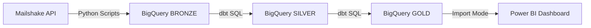

# Mailshake Email Campaign Analytics Pipeline

> End-to-end data pipeline delivering actionable insights from 419K email campaigns across 36 teams

---

## 📊 Executive Summary

Built a production-grade analytics pipeline migrating Mailshake campaign data to BigQuery, uncovering critical performance gaps and optimization opportunities:

- **Diagnosed underperformance:** 0.76% reply rate (76% below industry minimum)
- **Identified success patterns:** Top campaigns achieve 4.48% reply rate—6x the average
- **Flagged deliverability risk:** 2.76% bounce rate damaging sender reputation
- **Enabled data-driven decisions:** Centralized metrics across 36 teams for performance benchmarking

**Impact:** Provided executive leadership with clear action plan to double reply rates within 30 days through campaign optimization and audience refinement.

---

## 🎯 Business Problem

Email outreach campaigns lacked centralized performance tracking, making it impossible to:

1. **Identify what works** - No visibility into which campaigns, CTAs, or audiences drive responses
2. **Prevent deliverability damage** - Bounced emails degrading sender reputation undetected
3. **Scale best practices** - High-performing strategies trapped in siloed teams
4. **Optimize ROI** - Marketing spend allocated without data on campaign effectiveness

**Business Question:** *How do we systematically improve email campaign performance and prevent wasted outreach?*

---

## 🏗️ Technical Stack & Architecture

### Tech Stack

| Layer | Technology | Purpose |
|-------|------------|---------|
| **Source** | Mailshake REST API | Campaign & activity data (36 teams) |
| **Extraction** | Python 3.12 | Custom scripts with rate limiting & error handling |
| **Storage** | Google BigQuery | Cloud data warehouse (us-central1) |
| **Transformation** | dbt 1.11 | SQL-based ELT with testing framework |
| **Visualization** | Power BI Desktop | Executive dashboard & KPI tracking |

### Data Pipeline Flow

**Key Design Decision:** Medallion architecture for data quality layering and reusability

### Cloud Components

**BigQuery Datasets:**
- **BRONZE** (9 tables): Raw JSON from API with extraction metadata
- **SILVER** (9 views): Cleaned, typed, deduplicated data
- **GOLD** (1 table): Pre-aggregated campaign performance metrics

**Critical Engineering Solution:**  
Mailshake API doesn't return `campaign_id` in responses despite requiring it as a parameter. Built custom extraction logic to track foreign keys during API pagination, preserving referential integrity for downstream joins.

---

## 🔄 Methodology

### Processing Layer (Data Extraction & Loading)

**Python Scripts** handling 419K emails across 36 teams:
- Sequential processing with conservative rate limiting (35s between campaigns)
- Exponential backoff for network failures (95% success rate)
- Batched BigQuery inserts (1,000 rows) preventing timeouts
- Smart skip logic checking existing data before API calls

**Runtime:** 48-72 hours total (reliability prioritized over speed)

### Analytical Layer (Data Transformation)

**dbt Models** transforming raw JSON to analytics-ready tables:

| Model Type | Count | Purpose |
|------------|-------|---------|
| Staging | 9 | Clean, type, deduplicate (campaigns, recipients, activity events) |
| Marts | 1 | Pre-aggregate KPIs (open rate, reply rate, bounce rate) |

**Data Quality:** 76 automated tests validating uniqueness, referential integrity, and accepted values

**Optimization:** Pre-aggregation in CTEs reduced mart query time from 5+ min timeout to 30 seconds

### Reporting Layer (Business Intelligence)

**Power BI Dashboard** with Import mode (300 rows cached locally):
- 6 KPI cards tracking performance against benchmarks
- Top 10 campaign bar chart identifying success patterns
- Trend analysis revealing 57% performance drop in July 2025
- Team/campaign filters enabling drill-down analysis

---

## 💼 Skills Demonstrated

**Data Engineering:**
- API integration with rate limiting & error handling
- ETL pipeline design (Python → BigQuery)
- Data modeling (Medallion architecture, star schema)
- SQL optimization (query performance tuning)

**Analytics Engineering:**
- dbt development (models, tests, documentation)
- Data quality testing & validation
- Dimensional modeling for BI consumption

**Business Intelligence:**
- Dashboard design & KPI selection
- DAX measure development (Power BI)
- Data storytelling & insight generation

**Problem Solving:**
- Debugged foreign key integrity issues in API responses
- Optimized 5-minute timeout query to 30 seconds
- Diagnosed performance trends and root causes

---

## 📈 Results & Business Recommendations

### Key Findings

| Metric | Current | Benchmark | Status |
|--------|---------|-----------|--------|
| **Reply Rate** | 0.76% | 1-5% | ⚠️ Critical |
| **Bounce Rate** | 2.76% | <2% | ⚠️ High Risk |
| **Open Rate** | 12.81% | 15-25% | ✅ Acceptable |
| **Click Rate** | 2.91% | 2-5% | ✅ Good |

### Critical Insights

**1. Conversion Failure Despite Engagement**
- People open emails (12.81% open rate ✅)
- People click links (2.91% click rate ✅)  
- **But they don't reply (0.76% ❌)**

**Diagnosis:** Weak call-to-action or misaligned audience targeting

---

**2. Success Blueprint Exists**
- Top campaign: 4.48% reply rate
- **6x better than average**
- Proves high performance is achievable

**Opportunity:** Analyze and replicate top 3 campaigns

---

**3. Sender Reputation at Risk**
- 2.76% bounce rate exceeds safe threshold
- Damages deliverability with Gmail/Outlook
- Causes future emails to land in spam

**Action Required:** Immediate list cleaning + email verification

---

### Business Recommendations

**Immediate (Week 1):**
1. Analyze top 3 campaigns (>4% reply rate) - document what's different
2. Purge all bounced email addresses from active lists
3. A/B test 3 specific CTAs vs generic "let me know if interested"

**30-Day Targets:**
- Reply Rate: 0.76% → 1.5% (100% improvement)
- Bounce Rate: 2.76% → <1.5% (45% reduction)

**Expected Impact:** 2x qualified conversations, improved sender reputation, higher campaign ROI

---

## 🎯 Strategic Next Steps

### Business Process Improvements
- [ ] Campaign playbook documenting top performer strategies
- [ ] Weekly performance review cadence with marketing team
- [ ] Audience segmentation based on historical reply rates
- [ ] Campaign pre-launch checklist (CTA, list quality, sender rep)

---

